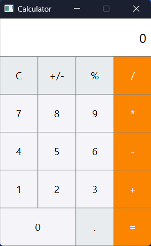

# Simple Calculator – Qt C++ Project

This is a **simple calculator** desktop application built using **Qt (C++)**.  
It is my **first project** using the Qt framework, and it helped me learn how to create GUI applications using **signals and slots**.

## 📦 Features

- Graphical user interface built with Qt Widgets
- Basic arithmetic operations:
  - Addition (+)
  - Subtraction (−)
  - Multiplication (×)
  - Division (÷)
- Clear button to reset input

## 🛠️ Technologies Used

- Qt 6
- C++
- Qt Creator IDE
- `.ui` file for GUI design
- `.pro` file for project configuration

## 🖼️ Screenshot

## Author

Ragueb Yacine - This is my first project using Qt. I'm learning C++ and Qt to build more complex desktop applications in the future.

- Website - [Yacine Ragueb](https://yacineragueb.vercel.app/)
- LinkedIn - [@yacineRagueb](https://www.linkedin.com/in/yacineragueb/)